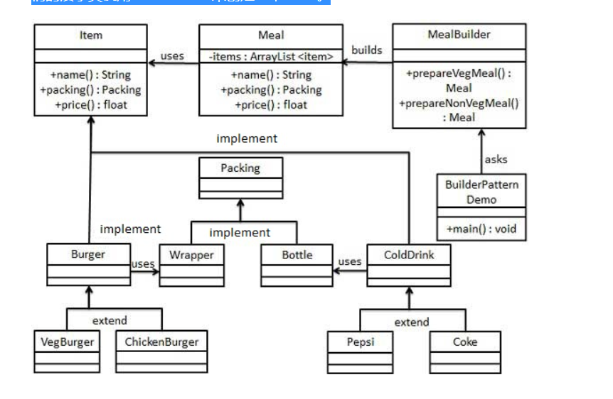

建造者模式（cn.atsuc.Fanctory.cn.atsuc.Fanctory.Builder Pattern）使用多个简单的对象一步一步构建成一个复杂的对象。这种类型的设计模式属于创建型模式，它提供了一种创建对象的最佳方式。

一个 cn.atsuc.Fanctory.cn.atsuc.Fanctory.Builder 类会一步一步构造最终的对象。该 cn.atsuc.Fanctory.cn.atsuc.Fanctory.Builder 类是独立于其他对象的。

**何时使用**一些基本部件不会变，而其组合经常变化的时候。

**如何解决**将变与不变分离开。

应用实例： 1、去肯德基，汉堡、可乐、薯条、炸鸡翅等是不变的，而其组合是经常变化的，生成出所谓的"套餐"。 2、JAVA 中的 StringBuilder。

优点： 1、建造者独立，易扩展。 2、便于控制细节风险。

缺点： 1、产品必须有共同点，范围有限制。 2、如内部变化复杂，会有很多的建造类。

使用场景： 1、需要生成的对象具有复杂的内部结构。 2、需要生成的对象内部属性本身相互依赖。

**注意事项**与工厂模式的区别是：建造者模式更加关注与零件装配的顺序。

建造者模式将复杂产品的构建过程封装在不同的方法中，使得创建过程非常清晰，能够让我们更加精确的控制复杂产品对象的创建过程，同时它隔离了复杂产品对象的创建和使用，使得相同的创建过程能够创建不同的产品。用一个指挥官去指定需要创建哪个对象，指定了创建顺序。把具体的创建过程隐藏了起来。如果需要创建不同种类的对象只需要传入不同的实现类就行了。这就是建造者模式。

但是如果某个产品的内部结构过于复杂，将会导致整个系统变得非常庞大，不利于控制，同时若干个产品之间存在较大的差异，则不适用建造者模式，毕竟这个世界上存在相同点大的两个产品不多，所以它的使用范围有限。

我们假设一个快餐店的商业案例，其中，一个典型的套餐可以是一个汉堡（Burger）和一杯冷饮（Cold drink）。汉堡（Burger）可以是素食汉堡（Veg Burger）或鸡肉汉堡（Chicken Burger），它们是包在纸盒中。冷饮（Cold drink）可以是可口可乐（coke）或百事可乐（pepsi），它们是装在瓶子中。

我们将创建一个表示食物条目（比如汉堡和冷饮）的 Item 接口和实现 Item 接口的实体类，以及一个表示食物包装的 Packing 接口和实现 Packing 接口的实体类，汉堡是包在纸盒中，冷饮是装在瓶子中。

然后我们创建一个 Meal 类，带有 Item 的 ArrayList 和一个通过结合 Item 来创建不同类型的 Meal 对象的 MealBuilder。BuilderPatternDemo，我们的演示类使用 MealBuilder 来创建一个 Meal。

