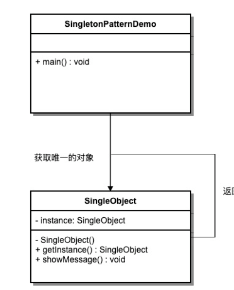

单例模式


单例其实就是相对于系统来说唯一的一个存在。这里引用百度百科中对单例的解释：“是一种常用的软件设计模式。在它的核心结构中只包含一个被称为单例的特殊类。通过单例模式可以保证系统中，应用该模式的一个类只有一个实例。即一个类只有一个对象实例。” 这种模式涉及到一个单一的类，该类负责创建自己的对象，同时确保只有单个对象被创建。这个类提供了一种访问其唯一的对象的方式，可以直接访问，不需要实例化该类的对象。

单例模式的设计规则

由定义我们可以很清晰的抽象出： 实现Java单例模式类有哪些通用设计规则？

（1）私有化类构造器。

（2）定义静态私有的类对象。

（3）提供公共静态的获取该私有类对象的方法。

了解了单例模式的概念，以及单例模式的通用设计规则，对于如何实现一个Java单例，应该是没什么阻碍了。这里我们还是要思考下单例模式的优点，或者说有啥好处，使用场景是什么？带着这些问题我们就能更好的设计单例模式。

为什么使用单例

1.Java单例模式解决了什么问题？

答：Java的单例模式主要解决了多线程并发访问共享资源的线程安全问题。

2.Java单例模式主要应用场景有哪些？

答：1.共享资源的访问与操作场景，如Windows系统的资源管理器，Windows系统的回收站, 显卡的驱动程序，系统的配置文件，工厂本身（类模板），应用程序的日志对象等。

​ 2.控制资源访问与操作的场景，如数据库的连接池，Java的线程池等。

单例模式的设计

单例模式的命名

单例的命名通常包含 cn.atsuc.Fanctory.singleton(以 cn.atsuc.Fanctory.singleton 开头或结尾) 或能按名称实际意义区分出在应用中唯一。

了解了Java单例模式出现的缘由以及出现的场合，那么，Java的单例究竟是以怎样的方式出现在这些场合中呢？ Java中单例模式的常用实现方式有哪些？

实现
我们将创建一个 SingleObject 类。SingleObject 类有它的私有构造函数和本身的一个静态实例。

SingleObject 类提供了一个静态方法，供外界获取它的静态实例。SingletonPatternDemo，我们的演示类使用 SingleObject 类来获取 SingleObject 对象。

单例模式的 UML 图


```text
Singleton 模式中的实例构造器可以设置为 protected 以允许子类派生。
Singleton 模式一般不要实现 Clone 接口，因为这有可能导致多个对象实例，与 Singleton 模式的初衷违背。
如何实现多线程环境下安全的 Singleton? 需注意对双检查锁的正确实现。
```

