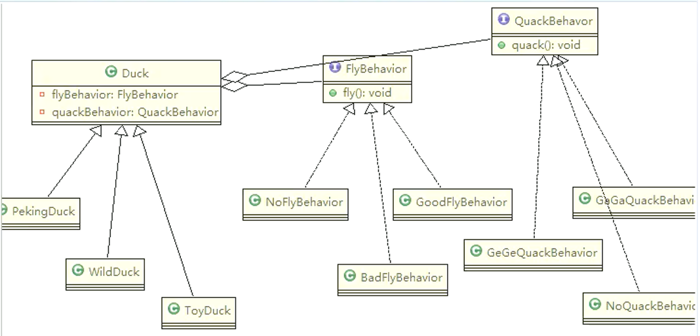
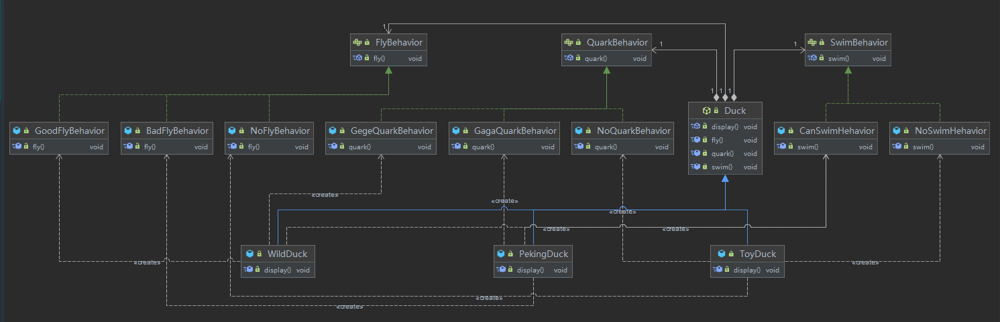

 1）策略模式（Strategy Pattern）中，定义算法族，分别封装起来，让他们之间可以互相替换。此模式让算法的变化独立于使用算法的客户
 2）这算法体现了几个设计原则

- 第一、把变化的代码从不变的代码中分离出来
- 第二、针对接口编程而不是具体类（定义了策略接口）
- 第三、多用组合/聚合，少用继承（客户通过组合方式使用策略）

3）思路分析
- 策略模式：分别封装行为接口，实现算法族，超类里放行为接口对象，在子类里具体设定行为对象
- 原则就是：分离变化部分，封装接口，基于接口编程各种功能。此模式让行为的变化独立于算法的使用者
- 
- 